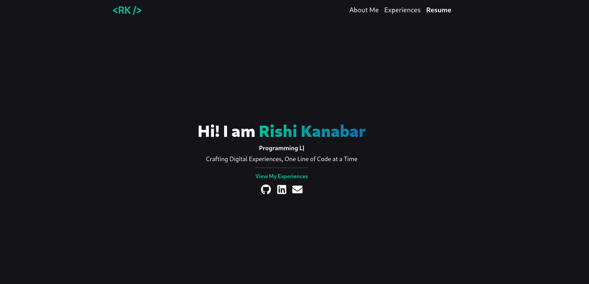

<h2 align="center">
  Portfolio Website<br/>
  <a href="https://kanabar.dev" target="_blank">kanabar.dev</a>
</h2>



### Description

[kanabar.dev](https://kanabar.dev) is my personal portfolio website designed to provide an overview of my skills, projects, and professional experiences.

### Technologies Used

- [React](https://react.dev/)
- [Vite](https://vitejs.dev/)
- [Tailwind CSS](https://tailwindcss.com/)

### Dependencies

- [NodeJS](https://nodejs.org/en)

### Building From Source

```bash
# Clone this repository:
git clone git@github.com:RishikeshNK/portfolio.git
cd portfolio

# Install the dependencies:
npm install

# Run the project:
npm run dev
```
